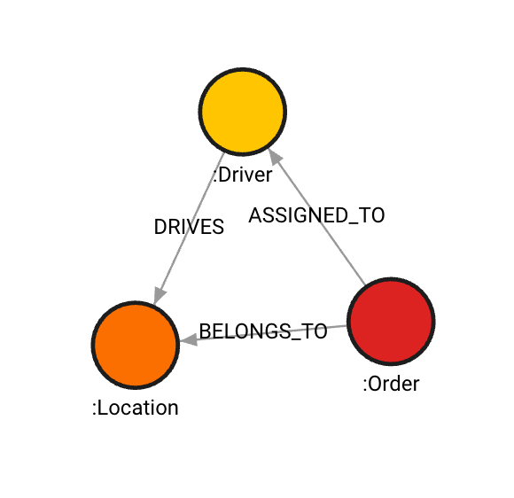

# Datasets

In this directory, you can find datasets used for the examples in various sizes and formats. 

## [graph500](./graph500/)
The [Graph500 dataset](https://networkrepository.com/graph500.php) is a generic and synthetic dataset that can be easily converted into a graph with mock data. It is often used in different benchmarks. 

Look into [dataset README](/datasets/graph500/README.md) to see how to prepare and manage the dataset before running any examples. 

## [logistic_dataset](./logistics_dataset/)

The logistic dataset comes in 1K, 10K, 100K and 1M size in scale. The 100K dataset comes in both CSV and Cypher formats.

